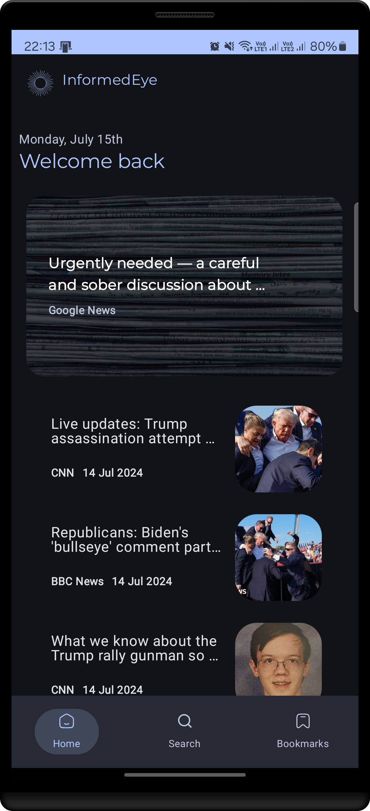
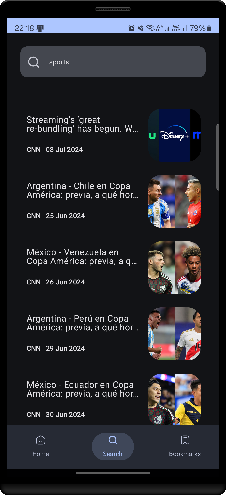
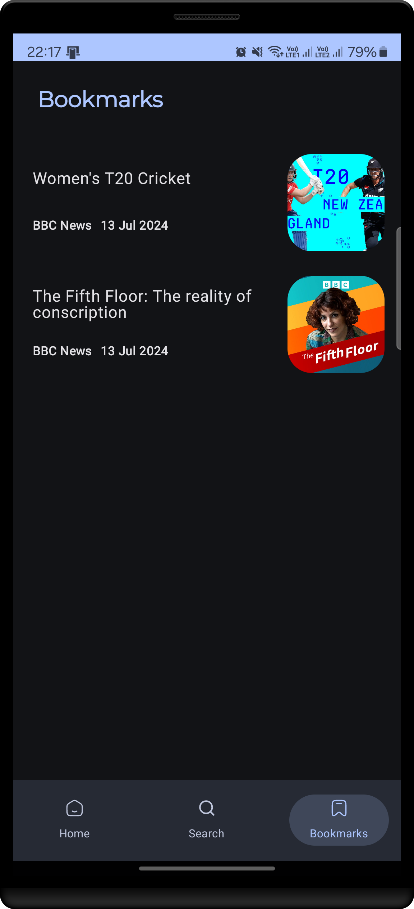
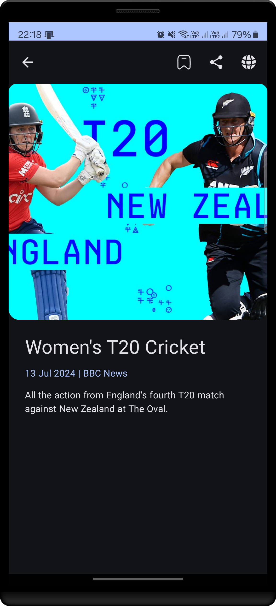
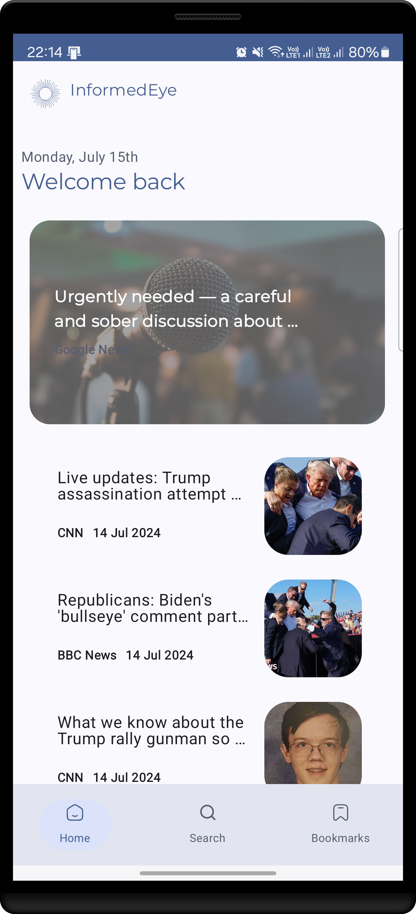
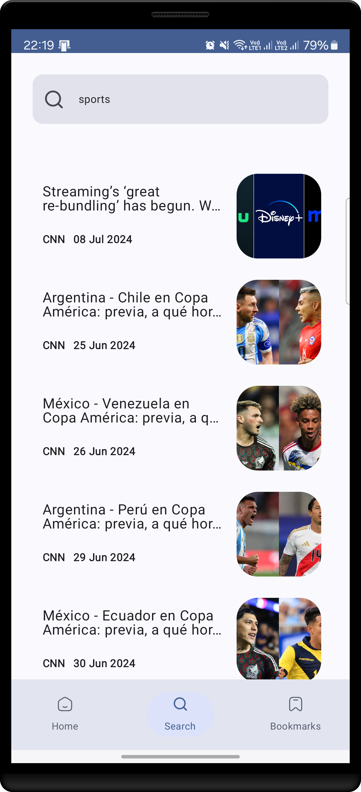
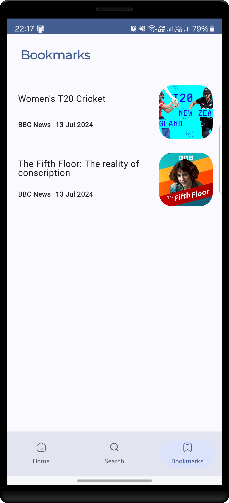

# InformedEye: A Minimalist News Reader App

## Overview
InformedEye is a sleek and straightforward news reader application designed to deliver the latest news 
articles to users. It leverages modern Android development practices, including Kotlin, MVVM and Clean architecture, 
and the innovative Jetpack Compose UI toolkit. A notable aspect of this project is its utilization of 
Jetpack Compose's new type-safe navigation feature, which is currently in its beta phase as of July 2024, 
specifically version **2.8.0-beta03**. This feature enhances the app's navigational experience by ensuring type 
safety during navigation actions, reducing runtime errors and improving developer productivity.

## Key Features
* **News Feed**: Access a curated selection of news articles from various sources.
* **Search Functionality**: Quickly find articles related to specific topics or keywords.
* **Offline Support**: Save articles for offline reading, ensuring you don't miss out on important stories.
* **Modern UI**: Delivers a contemporary user interface using Material Design components.
* **Enhanced Interactions**: Includes Android intent features for sharing article links and opening articles 
in a web browser, enhancing user engagement.

### Enhancing User Engagement with Android Intents
* **Share Article Links**: Users can share news article links with others directly from the app using Android's
  native share intent mechanism.
* **View Full Articles in Browser**: Users have the option to open full articles in a web browser, leveraging
  Android intents to initiate the browser activity with the article's URL.

## Technologies
* **Kotlin**: The foundation of the app, chosen for its concise syntax and safety features.
* **MVVM & Clean Architecture**: Organizes the codebase into layers for better maintainability and testability.
* **Jetpack Compose**: Employs the latest UI toolkit for building a responsive and modern UI.
* **Compose Type-Safe Navigation (Beta)**: Implements the beta version of type-safe navigation for enhanced reliability and developer experience.
* **NewsApi**: Serves as the news content provider, requiring an API key for access.

## App Screenshots
<p>
   <p>
       
      
      
      
   </p>
   <p>
      
      
      
      
   </p>
</p>

## Key Dependencies
InformedEye utilizes Gradle's new version catalog feature for managing dependencies, streamlining the 
build process and ensuring consistency across projects. The key dependencies include:

* **Kotlin**: Core library for Kotlin development.
* **Hilt-android**: Dependency injection framework.
* **Room**: Local database for storing articles.
* **Retrofit**: Networking library for API calls.
* **Coil**: Image loading library.
* **Paging 3**: Library for efficient data loading and pagination.

## Getting Started
To set up InformedEye, follow these steps:

### Prerequisites
* Android Studio Arctic Fox (or newer) installed.
* An Android device or emulator for testing.

### Configuration Steps
1. **Obtain an API Key**: Sign up on the [NewsApi](https://newsapi.org/) website to receive an API key.
2. **Configure API Key**: Place your API key in the `local.properties` file as `API_KEY=<your_api_key_here>`.
3. **Clone the Repository**: Use Git to clone the InformedEye repository.
    ```shell
    git clone https://github.com/BotsheloRamela/InformedEye.git
    ```
4. **Review Dependencies**: Familiarize yourself with the dependencies managed via Gradle's version catalog.
5. **Run the App**: Launch the app on an Android device or emulator to explore its features.

## Contributing
Contributions are what make the open-source community such an amazing place to learn, inspire, and create. 
Any contributions you make are greatly appreciated.

1. Fork the Project
2. Create your Feature Branch (`git checkout -b feature/AmazingFeature`)
3. Commit your Changes (`git commit -m 'Add some AmazingFeature'`)
4. Push to the Branch (`git push origin feature/AmazingFeature`)
5. Open a Pull Request

## Conclusion
InformedEye exemplifies the simplicity and efficiency of a well-crafted news reader app. By integrating 
modern Android development practices, including the beta version of type-safe navigation with Jetpack Compose, 
it offers a user-friendly and reliable news reading experience.